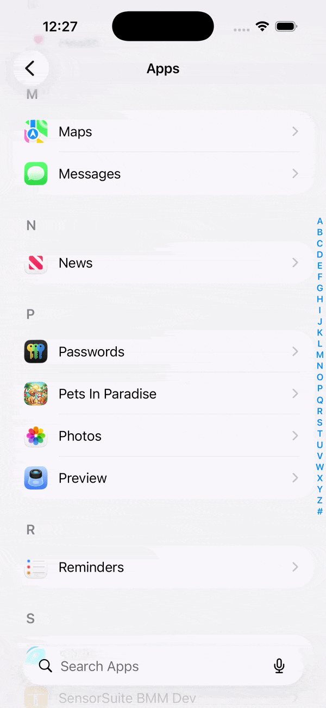

# FlagGen

[](https://github.com/symes-s/flag-gen/actions/workflows/ci.yml)

## The Settings App `.plist` Generator


FlagGen lets you define feature flags once in code, and get:

1. A screen in the iOS **Settings app** so QA/Debug builds can flip flags without a rebuild.
2. A single, typed Swift API (`FeatureFlags.default.myFlag`) the rest of your app reads from.



## How it fits together

Two packages are involved, and it's easy to mix them up:

- **`FlagGen`** (this repository) — a library of property wrappers (`@FeatureFlagToggle`, `@FeatureFlagEnum`, …) plus a small code generator.
- **`FeatureFlags`** — a small package you create in your own project. Declare your app's flags using FlagGen's property wrappers, and FlagGen's generator turns that into a `.plist` your app embeds in its Settings bundle.

A complete, working example of both lives in [`Example/`](Example) — a little pet-shop app. The integration guide below references it directly.

## Defining Feature Flags

Flags are properties on your `FeatureFlags` struct, declared with a property wrapper. The simplest is a toggle:

```swift
@FeatureFlagToggle(defaultValue: true, key: "name_of_key_enabled", title: "Name displayed in Settings App (optional)")
public var exampleToggleEnabled: Bool
```

FlagGen has more property wrappers beyond `@FeatureFlagToggle` — enums, radio groups, sliders, read-only info rows, section headers, and nested settings screens. See [Defining Feature Flags](Docs/DEFINING_FEATURE_FLAGS.md) for more detail.

## Using Feature Flags

In the app, import your generated `FeatureFlags` package, then simply:

  ```swift
  import FeatureFlags

  if FeatureFlags.default.exampleToggleEnabled {
    doThing()
  }
  ```

To react live to a flag changing while the app is running (e.g. right after the user flips it in Settings), use the publisher each property wrapper exposes via its projected value, e.g. `$exampleToggleEnabled.publisher` (backed by `LocalProvider.publisher(for:)`).

## Integrating FlagGen into an existing project

See the [Integration](Docs/INTEGRATION.md) doc for a full step-by-step walkthrough — adding the package, creating your own `FeatureFlags` package, generating the `.plist`, wiring up the Settings Bundle build phase, and the Xcode settings (like User Script Sandboxing) it depends on. Every step is cross-referenced against [`Example/`](Example).

## Adding a remote provider (LaunchDarkly, Firebase Remote Config, ...)

`LocalProvider` (`UserDefaults`-backed) is the only provider _FlagGen_ ships, but `ProviderType` is open for extension so you can register your own — see [Custom Providers](Docs/CUSTOM_PROVIDERS.md) for worked LaunchDarkly and Firebase Remote Config examples.
